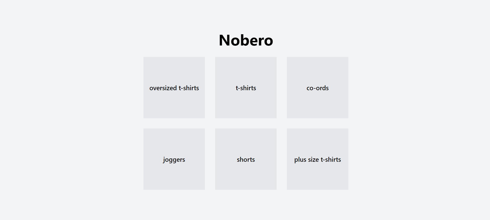
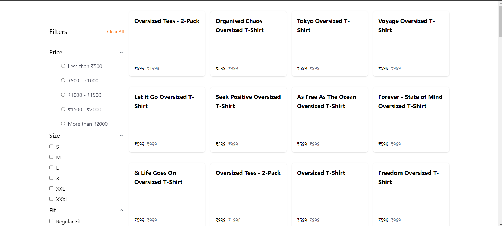
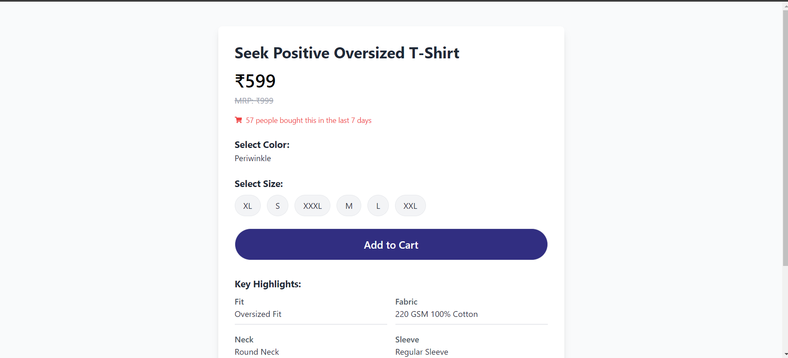

# Product Scraper and Viewer

## Overview

This project consists of three main components:
1. **Data Scraper**: Uses Scrapy to scrape product data from a website and stores it in a MongoDB database.
2. **Backend API**: Built using Django REST Framework (DRF) to provide a RESTful API for accessing the product data.
3. **Frontend Application**: Developed with React to display the product information to users.

## Components

### 1. Data Scraper

The data scraping is accomplished using Scrapy, a powerful and flexible scraping framework. The scraped data is then stored in a MongoDB database.

**Screenshot of Scraped Data:**


### 2. Backend API

The backend API is built with Django REST Framework and provides endpoints to fetch product data from the MongoDB database.

**Key Features:**
- Endpoints for retrieving product information
- Data retrieval based on product ID

### 3. Frontend Application

The frontend application is built using React. It provides a user interface for interacting with the product data through various components.

**Screenshots:**

**Home Page:**



**SubCategory Products Page:**



**Product Details Page:**



## Installation

To run this project, follow these steps:

1. **Clone the Repository:**
   ```bash
   git clone <repository-url>
   cd <repository-directory>
